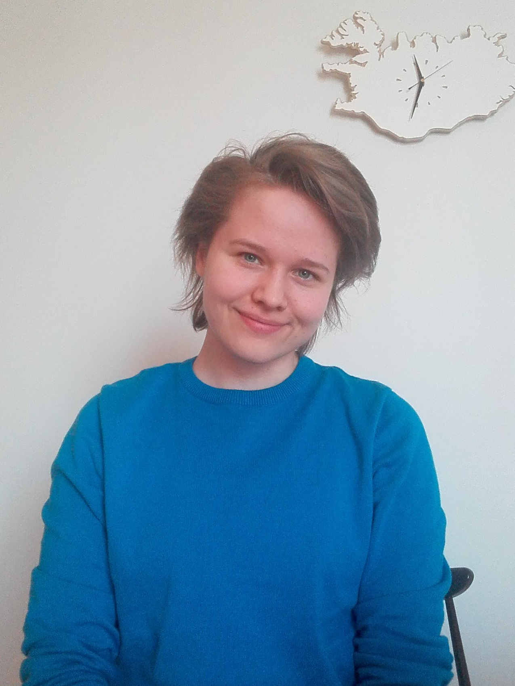

## Introduction

I am a Language Technology major at the University of Helsinki with a Bachelor's degree in Scandinavian Languages (Swedish as second domestic language). For my Bachelor's thesis I made an error analysis of Swedish to Finnish translations by Google translate (in Swedish).

Currently trying to compe up with something productive to do during the summer.

## Find me on

[LinkedIn](https://www.linkedin.com/in/varpu-vehom%C3%A4ki-575477200/) or [GitHub](https://github.com/vaveva)

## Hobbies, interests, etc.

I'm a bookworm, a sports enthusiast and a nature lover. I also sing in a choir.

